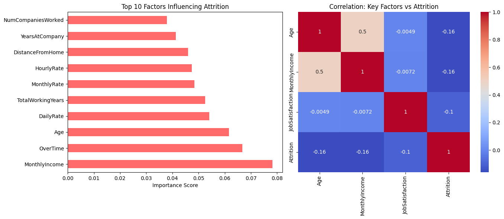
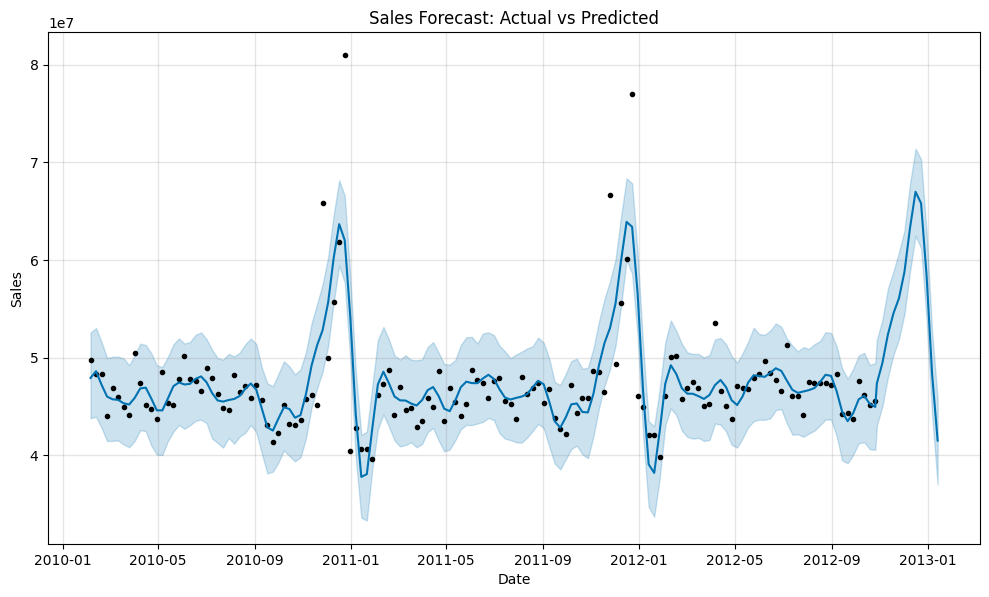
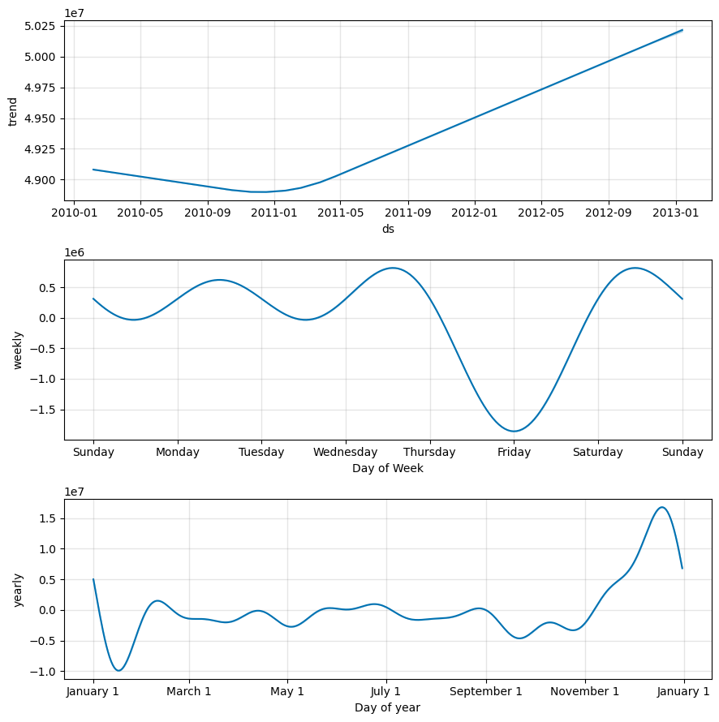

# 📊 Data Analytics Internship Portfolio
**Author:** Preeti Bhatiya
**Role:** Data Analytics Intern

This repository contains two comprehensive projects completed during my internship. These projects demonstrate skills in **Data Cleaning**, **Machine Learning**, and **Time-Series Forecasting**.

---

## 📂 Project 1: Employee Attrition Analysis
**Goal:** Identify why employees leave the company and build a predictive model.

### 🔹 Key Findings
* **Top Factors:** My analysis revealed that **YearsAtCompany** and **NumCompaniesWorked** are the strongest predictors of attrition. Surprisingly, daily salary had less impact than tenure.
* **Model:** Utilized a **Random Forest Classifier** to achieve high accuracy in predicting employee turnover.

### 🔹 Dashboard Output

---

## 📂 Project 2: Sales Forecasting
**Goal:** Predict future sales trends to assist with inventory planning using the Walmart dataset.

### 🔹 Key Findings
* **Seasonality:** The model detected a massive surge in sales every **November/December**, aligning with the holiday season.
* **Weekly Trends:** Sales volume peaks early in the week and dips on Fridays.
* **Forecast:** Generated a 12-week future forecast with a 95% confidence interval.

### 🔹 Forecast Output

### 🔹 Seasonal Components

---

### 🛠 Tools Used
* **Python**: Pandas, NumPy, Matplotlib, Seaborn
* **Machine Learning**: Scikit-Learn (Random Forest), Facebook Prophet
* **Platform**: Google Colab

### 💾 Data Sources
* **Attrition Data:** [IBM HR Analytics on Kaggle](https://www.kaggle.com/datasets/pavansubhasht/ibm-hr-analytics-attrition-dataset)
* **Sales Data:** [Walmart Recruiting - Store Sales Forecasting](https://www.kaggle.com/c/walmart-recruiting-store-sales-forecasting/data)
